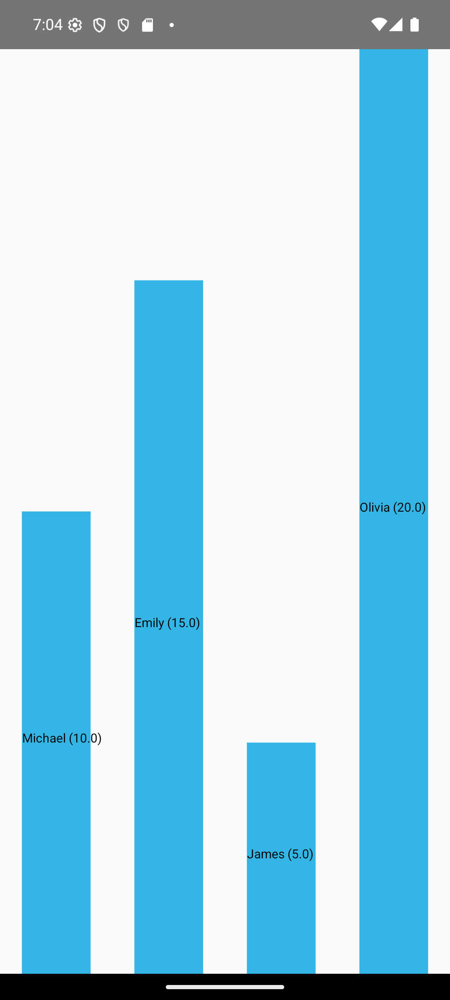

# Android Bar Chart Custom View 📊

Một thư viện vẽ biểu đồ cột (Bar Chart) tùy biến cao cho Android, được xây dựng bằng Custom View và Canvas.

    

## Tính năng chính �
- Vẽ biểu đồ cột với dữ liệu động
- Tùy chỉnh màu sắc, kích thước các thành phần
- Hiệu ứng animation khi vẽ
- Hiển thị giá trị trên mỗi cột
- Hỗ trợ cảm ứng (click/touch)
- Tích hợp dễ dàng qua XML
- Tương thích từ Android API 21 trở lên

## Cài đặt 📦
Thêm dependency vào file `build.gradle` cấp app:
